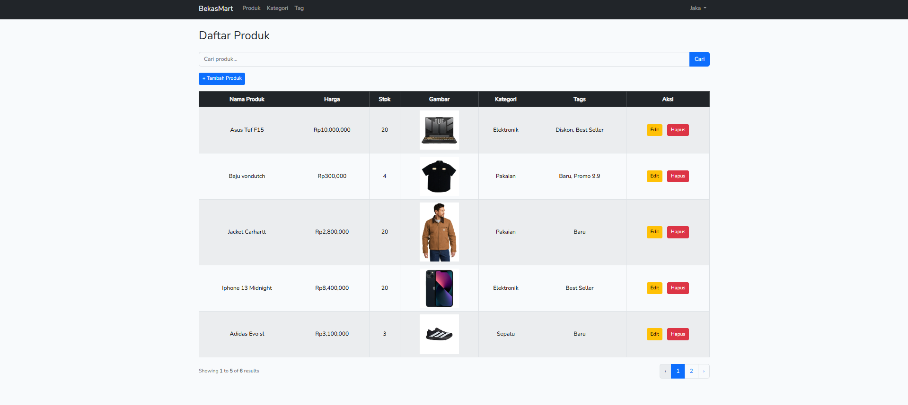

# Aplikasi Manajemen Produk
Aplikasi sederhana berbasis Laravel untuk mengelola data produk, termasuk fitur tambah, edit, hapus, dan pencarian.

## ✨ Fitur
- CRUD Produk (Create, Read, Update, Delete)
- Validasi input
- Flash Message
- Pencarian produk
- Pagination
- Relasi Produk dengan Kategori (one-to-many)
- Relasi Produk dengan Tag (many-to-many)

## 🚀 Instalasi
1. Clone repo:
   ```bash
   git clone https://github.com/jkmuhamad/crud-produk-laravel
2. Install dependency backend `composer install`
3. Install dependency frontend `npm install`
4. Setup `.env`
5. Generate key `php artisan key:generate`
6. Jalankan migration `php artisan migrate`
7. Jalankan build frontend `npm run dev`
8. Jalankan server `php artisan serve`

## 📌 Penggunaan
Buka [http://127.0.0.1:8000](http:

# Daftar Produk
Berikut tampilan halaman produk:


## 🛠️ Teknologi
- Laravel 12
- MySQL
- Bootstrap 5

